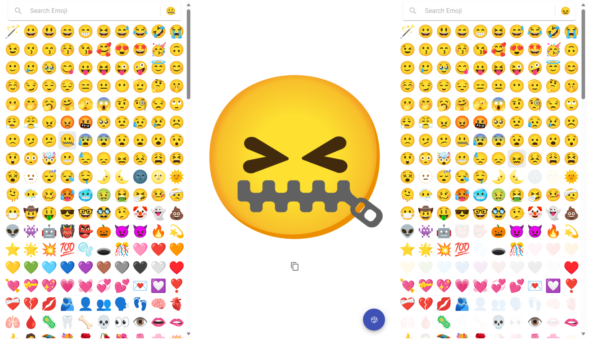
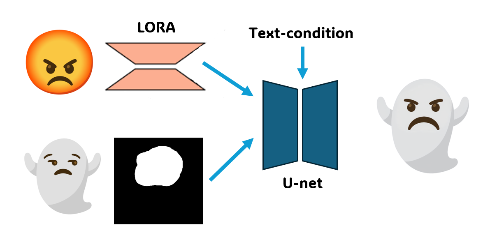

# Possible implementation toward Emoji-Kitchen
This is an repo for the possible implementation of [Emoji-Kitchen](https://emojikitchen.dev/) by Google. I will continue try different kinds of methods to achieve the result like Emoji-Kitchen using diffusion model. All suggestion are welcome!! The repo is 


## Method one: Inpainting + LORA
### 1. Train LoRAs for reference image
In this step, LoRA for one image is trained based on SDXL. Using SDXL here is important because they found that the pre-trained SDXL exhibits strong learning when fine-tuned on only one reference style image.

Fortunately, diffusers already implemented LoRA based on SDXL [here](https://github.com/huggingface/diffusers/blob/main/examples/dreambooth/README_sdxl.md) and you can simply follow the instruction. 

For example, your training script would be like this.
```bash
export MODEL_NAME="stabilityai/stable-diffusion-xl-base-1.0"
# for subject
export OUTPUT_DIR="lora-sdxl-dog"
export INSTANCE_DIR="dog"
export PROMPT="a sbu dog"
export VALID_PROMPT="a sbu dog in a bucket"

# for style
# export OUTPUT_DIR="lora-sdxl-waterpainting"
# export INSTANCE_DIR="waterpainting"
# export PROMPT="a cat of in szn style"
# export VALID_PROMPT="a man in szn style"

accelerate launch train_dreambooth_lora_sdxl.py \
  --pretrained_model_name_or_path=$MODEL_NAME  \
  --instance_data_dir=$INSTANCE_DIR \
  --output_dir=$OUTPUT_DIR \
  --instance_prompt="${PROMPT}" \
  --rank=64 \
  --resolution=1024 \
  --train_batch_size=1 \
  --learning_rate=5e-5 \
  --report_to="wandb" \
  --lr_scheduler="constant" \
  --lr_warmup_steps=0 \
  --max_train_steps=1000 \
  --validation_prompt="${VALID_PROMPT}" \
  --validation_epochs=50 \
  --seed="0" \
  --mixed_precision="fp16" \
  --enable_xformers_memory_efficient_attention \
  --gradient_checkpointing \
  --use_8bit_adam \
  --push_to_hub \
```

### 2. Inpainting using LoRA
Can just follow the code in **inference_inpainting.ipynb** they are based on diffuser and are very easy to understand.


### 3. Comparsion between methods

## TODO

- [x] Some Comparision with differen methods
- [ ] Thinking of Method Two
